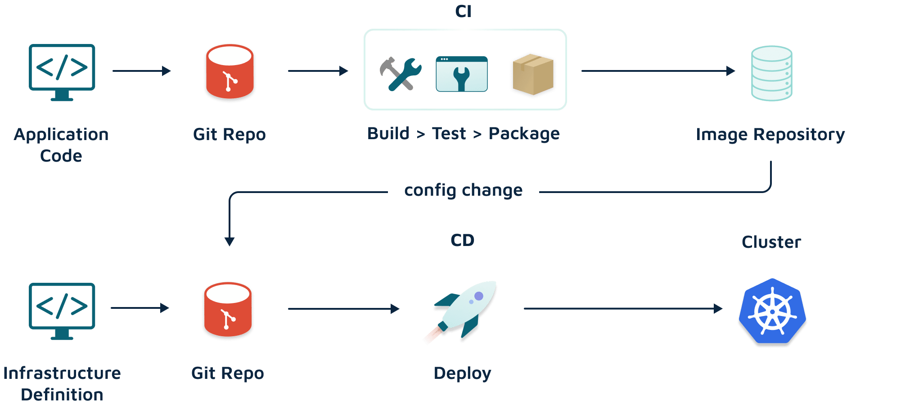

# Argo Best Practice

## Argo CD

- Store kubernetes manifests in git repository.
- Group applications for management and visibility.
- Implement RBAC to restrict access to Argo CD.
- Automated sync for continious delivery.

## Argo Rollouts

- Canary deployments to gradually shift traffic to new version.
- Blue-Green deployments to switch traffic between environment.
- Automated rollbacks when in failure.
- Metrics monitoring to track performance.

## Secret management

- [Bitnami Sealed Secrets](https://engineering.bitnami.com/)
- [Argo CD Vault plugin](https://github.com/argoproj-labs/argocd-vault-plugin)

## Deployment practice

- [Argo Projects](https://github.com/argoproj/argoproj)
- [Argo Rollouts](https://github.com/argoproj/argo-rollouts)
- [Argo Workflows](https://github.com/argoproj/argo-workflows)
- [Argo Events](https://github.com/argoproj/argo-events)
